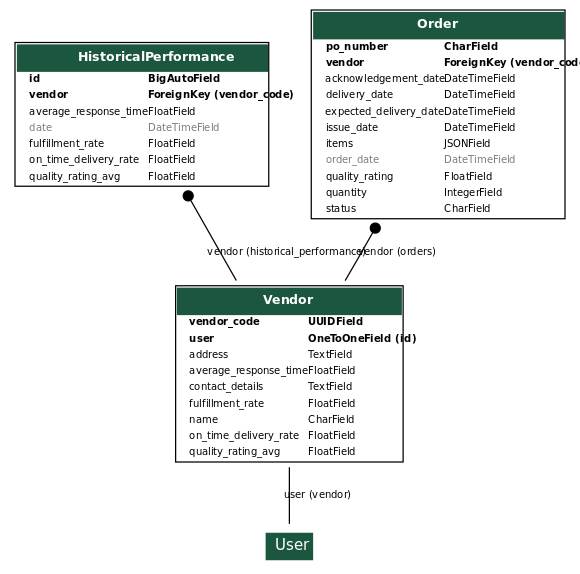
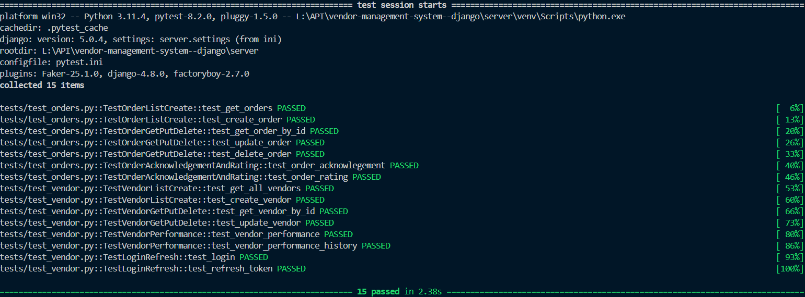

# Vendor Management system (Django Rest API)

### simple API that can handle vendor operations

### Index

- [Features](#features)
- [Steps to run](#steps-to-run)
- [Database Desgin](#database-desgin)
- [simple flow diagram](#flow-diagram)
- [API Documentation](#api-documentation)

---

### Features:

- CRUD operations on Vendor and Orders
- JWT Token Authentication for Vendor Update , Delete operations
- Vendor Performance tracking with Django custom signals
- swagger openAPI docs
- Dockerized
- Auto tested using Githops

## Steps to run

### 1. Clone this respository

### 2. Create `.env` file with following variables

```
DB_USER='postgres'
DB_PASSWORD='postgres'
DB_HOST='localhost'
DB_PORT='5432'
DB_NAME='vendorapi'
DEBUG='True'
```

### 2. Create and Activate Virtual Environment

> Its a best practice to always use a virtual environment

#### Create Virtual Environment

    Python -m venv venv-vendor

#### Activate Virtual Environment for Windows

    venv-vendor\Scripts\activate

### 3. install dependencies

- if you have docker simply run `docker-compose up`
- else run `pip install -r requirements.txt` make sure you have python and pip installed

### 4. make migrations and run server

- `python manage.py migrate`
- `python manage.py runserver` server will be running on `http://127.0.0.1:8000/`, use any API client or use swagger UI at `http://127.0.0.1:8000/api/schema/docs/`

### 5. Testing

- if you want to run tests simply run `pytest -v`

> Make use of Makefile for running commands if you have Make installed.

## Database Desgin



## Flow Diagram


### only above flows are restricted to follow , other are independent

eg: order cannot be updated without acknowledgement

## Tested

> Done local testing and created automatic testing using github actions



## API Documentation

---

### This API docs has 3 main Sections

- [vendors](#vendors)
- [authentication](#authentication)
- [orders](#orders)

## Vendors

### 1. `POST` Create Vendor

    /api/vendors/

#### Body

```json
{
  "user": {
    "username": "loki4",
    "password": "password"
  },
  "name": "loki",
  "contact_details": "903813",
  "address": "ap "
}
```

#### Response

```json
{
  "vendor_code": "af3d9327-6bbb-4e0c-9845-378fc9c501a8",
  "name": "loki",
  "contact_details": "903813",
  "address": "ap",
  "user": {
    "username": "loki4"
  }
}
```

### 2. `GET` Get all Vendors

    /api/vendors/

#### Response

```json
[
  {
    "vendor_code": "af3d9327-6bbb-4e0c-9845-378fc9c501a8",
    "name": "loki",
    "contact_details": "903813",
    "address": "ap",
    "user": {
      "username": "loki4"
    }
  }
]
```

### 3. `PUT` update a Vendor

    /api/vendors/:Vendor_id/

#### Authorization

    Bearer Token

> Token is an access token Obtained from login endpoint

#### Body

    {
    "name": "devarapu ",
    "address":"vizag"
    }

#### Response

```json
{
  "name": "devarapu",
  "address": "vizag"
}
```

### 4. `DELETE` Delete a Vendor

    /api/vendors/:Vendor_id/

#### Authorization

    Bearer Token

> Token is access token Obtained from login

#### Response

```json
{
  "msg": "deleted successfully"
}
```

### 5. `GET` Get single Vendor

    /api/vendors/:Vendor_id/

#### Response

```json
{
  "vendor_code": "15bc07ed-604e-46fb-991c-8e6e844c2069",
  "name": "loki",
  "contact_details": "903813",
  "address": "ap",
  "user": {
    "username": "loki84"
  }
}
```

### 6. `GET` Vendor Performance

    /api/vendors/:Vendor_id/performance

#### Response

```json
{
  "vendor_code": "15bc07ed-604e-46fb-991c-8e6e844c2069",
  "user": {
    "username": "loki84"
  },
  "name": "loki",
  "contact_details": "903813",
  "address": "ap",
  "on_time_delivery_rate": 0.0,
  "quality_rating_avg": 0.0,
  "average_response_time": 0.0,
  "fulfillment_rate": 0.0
}
```

> Vendor performance metrics by default has 0.0 , upon order completions metrics are reacalculated

### 7. `GET` Vendor performance history

    /api/vendors/:Vendor_id/performance-history

#### Response

```json
[
  {
    "id": 2,
    "date": "2024-05-18T02:10:08.555345",
    "on_time_delivery_rate": 100.0,
    "quality_rating_avg": 0.0,
    "average_response_time": -14350.758442266666,
    "fulfillment_rate": 100.0,
    "vendor": "15bc07ed-604e-46fb-991c-8e6e844c2069"
  },
  {
    "id": 1,
    "date": "2024-05-18T02:09:22.769940",
    "on_time_delivery_rate": 0.0,
    "quality_rating_avg": 0.0,
    "average_response_time": -14350.758442266666,
    "fulfillment_rate": 0.0,
    "vendor": "15bc07ed-604e-46fb-991c-8e6e844c2069"
  }
]
```

## Orders

### 1. `POST` Create order

    /api/purchase_orders/

#### Body

    {
    "vendor_id":"ehduw738end",
    "items":[
        {"pid":"979373","price":"65666"}
    ],
    "quantity":10
    }

#### Reponse

```json
{
  "po_number": "e8299df9-7376-43bb-8f86-f7e695143f06",
  "order_date": "2024-05-18T02:08:45.506536",
  "expected_delivery_date": "2024-05-23T02:08:45.506536",
  "delivery_date": null,
  "items": [
    {
      "pid": "979373",
      "price": "65666"
    }
  ],
  "quantity": 10,
  "status": "pending",
  "quality_rating": null,
  "issue_date": "2024-05-18T02:08:45.506536",
  "acknowledgement_date": null,
  "vendor": "15bc07ed-604e-46fb-991c-8e6e844c2069"
}
```

### 2. `PUT` Update an order

    /api/purchase_orders/:po_id/

#### Body

    {
        "delivery_date":"2024-05-10T09:43",
        "status":"completed"
    }

#### Response

```json
{
  "status": "completed",
  "delivery_date": "2024-05-10T09:43:00"
}
```

### 3. `DELETE` delete an order

    /api/purchase_orders/:po_id/

#### Response

```json
{
  "msg": "deleted successfully"
}
```

### 4. `GET` get all orders

    /api/purchase_orders/

#### Response

```json
[
  {
    "po_number": "e8299df9-7376-43bb-8f86-f7e695143f06",
    "order_date": "2024-05-18T02:08:45.506536",
    "expected_delivery_date": "2024-05-23T02:08:45.506536",
    "delivery_date": "2024-05-10T09:43:00",
    "items": [
      {
        "pid": "979373",
        "price": "65666"
      }
    ],
    "quantity": 10,
    "status": "completed",
    "quality_rating": null,
    "issue_date": "2024-05-18T02:08:45.506536",
    "acknowledgement_date": "2024-05-08T02:58:00",
    "vendor": "15bc07ed-604e-46fb-991c-8e6e844c2069"
  }
]
```

### 5. `GET` get single order details

    /api/purchase_orders/:po_id/

#### Response

```json
{
  "po_number": "e8299df9-7376-43bb-8f86-f7e695143f06",
  "order_date": "2024-05-18T02:08:45.506536",
  "expected_delivery_date": "2024-05-23T02:08:45.506536",
  "delivery_date": "2024-05-10T09:43:00",
  "items": [
    {
      "pid": "979373",
      "price": "65666"
    }
  ],
  "quantity": 10,
  "status": "completed",
  "quality_rating": null,
  "issue_date": "2024-05-18T02:08:45.506536",
  "acknowledgement_date": "2024-05-08T02:58:00",
  "vendor": "15bc07ed-604e-46fb-991c-8e6e844c2069"
}
```

### 6. `POST` Acknowledge an order

    /api/purchase_orders/:po_id/acknowledge

#### Body

    {
        "acknowledgement_date":"2024-05-08T02:58"
    }

#### Response

```json
{
  "acknowledgement_date": "2024-05-08T02:58:00"
}
```

### 7. `POST` Rating an order

    /api/purchase_orders/:po_id/rating

#### Body

    {
        "quality_rating":2
    }

#### Response

```json
{
  "quality_rating": 2.0
}
```

## Authentication

### 1. `POST` Login

    /api/vendors/login

#### Body

```json
{
  "username": "loki1234",
  "password": "password"
}
```

#### response

```json
{
  "refresh": "eyJhbGciOiJIUzI1NiI......9.lSlYCO7_RQ",
  "access": "eyJhbGciOiJIUz.....8tQiK4axqCvhqrlCrY"
}
```

### 2. `POST` Refresh Token

    /api/vendors/login/refresh

#### Body

```json
{
  "refresh": "oj3elkend832y3...."
}
```

#### Response

```json
{
  "access": "eyJ....WN1oJTkFWk6L1s9M"
}
```
